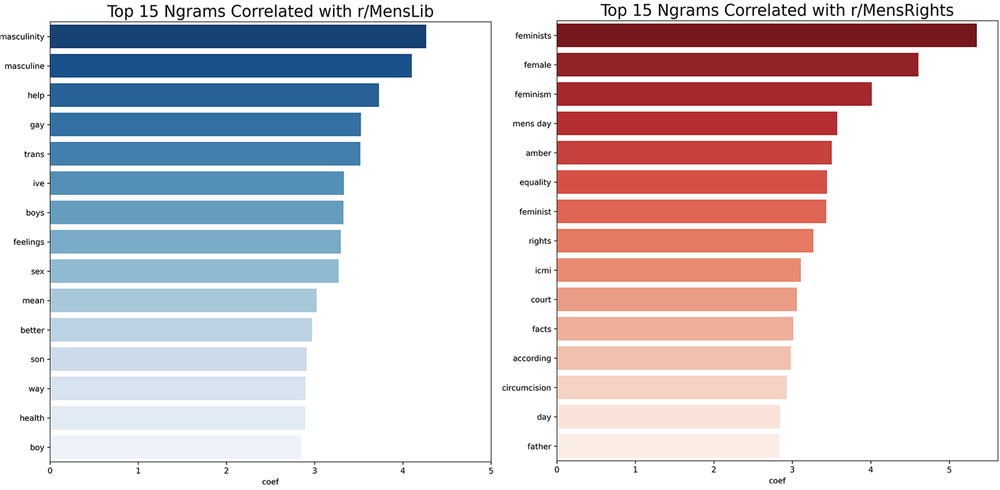

# Project 3 - Subreddit Classification with NLP

## Introduction

Reddit is a collection of interest-based communities known as subreddits, with content that covers almost anything you can imagine.  Within each subreddit, users can create text or image posts, and upvote or downvote posts to express approval or disapproval regarding the content of the post. The number of upvotes and downvotes are fed into a hot-ranking algorithm to determine a score for the post, with higher scoring posts rising to the top of the subreddit.

The goal of this project is simple -- to <b>classify posts from two different subreddits based on their title and selftext</b>, or text within the body of the post. This can serve multiple purposes including:
- Help new users post to the right subreddit (subreddit names can be highly misleading)
- Allow subreddit moderators to easily identify posts that might not belong to their particular subreddit.

For this project, I selected two subreddits that are ostensibly similar on the surface -- `r/MensLib` and `r/MensRights`. Both subreddits focus mainly on male issues such as suicide or homelessness, and allow men a space to discuss their personal beliefs regarding their position in society. The main difference between these subreddits is that `r/MensLib` has a [broad definition of masculinity and supports feminism](https://www.reddit.com/r/MensLib/comments/93oyty/menslibs_official_position_on_the_mens_rights/), while `r/MensRights` generally has a narrower definition of masculinity and is driven by the idea that [feminism/feminists are actively harming men](https://www.reddit.com/r/MensRights/comments/jz1lzz/how_feminist_shaming_tactics_needlessly_cause/), and that there is [serious discrimination against men inherent in western societies](https://www.reddit.com/r/MensRights/wiki/faq#wiki_1._what_is_r.2Fmensrights.3F).

## Executive Summary

To get the necessary posts for this project, I scrapped 1000 'hot' or popular posts from each subreddit using the Python Reddit API Wrapper (PRAW) and Reddit's API which gives access to each subreddit's .JSON. 

I then removed null values, URL and HTML tags within each post. I then vectorized each post and tested out various classification models before settling on a combination of TfidfVectorizer and Logistic Regression that was able to accurately classify 83.4% of posts correctly.

To summarize, our final model:
<i>
- used Tfidf Vectorization with no max feature limit  
- included only words or n-grams that appeared in at least 4 posts  
- excluded stop words and ignored terms that that appeared in more than 20% of posts  
- used Logistic Regression with Ridge regluarization (α = 0.1 | C = 10)
</i>

Unsurprisingly, our model reveals that `r/MensRights` is fundamentally opposed to feminism, while `r/MensLib` supports feminism and has a broad and LGBTQ-inclusive perspectives of masculinity. `r/MensRights` also has a very heavy topical focus on current events like the ongoing Johnny Depp and Amber Heard court case.

Our model however does have some limitations, especially in misclassifying `r/MensRights` posts as `r/MensLib` posts. When it comes to the wire, both subreddits care deeply about similar issues facing men (e.g. male suicide, male parenting, male gential cutting), even if their approach and beliefs are fundamentally different.

To further improve model accuracy, we'd ideally need to train our model to recognize slightly more abstract concepts such as the level of introspection or sentiment within the post. This would allow our model to deal with issues that are topical to `r/MensRights` (e.g. Johnny Depp and Amber Heard), but classify posts not just by mention of a name, but also by syntactic patterns that suggest introspection and openness such as like 'I have been thinking' or 'I'd love to hear people's views'.

## Recommendations
Beyond easing the burden of moderators by giving them the ability to classify posts from two different subreddits based on their title and selftext, there are a number of other possible applications for this model.

By looking at the probabilities associated with each post, moderators can also understand the overall direction of their subreddit. It's often hard to trace the evolution of subreddits over time, however, by looking at the posts that have an extremely high classification probability (>0.99), moderators can see the language and topics that have become characteristic or emblematic of their community.

Depending on their objectives, moderators can then try to increase the diversity of topics within their subreddit, or try to broaden the conversation to other areas.

The sentiment analysis that we implemented could also be useful here for moderators from r/MensLib who are naturally keen on maintaining positive and constructive discourse. By monitoring changes in sentiment score over time, they can determine the overall 'mood' of their community and proactively work to address points of conflict.
